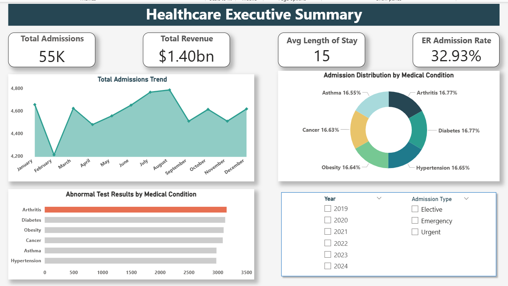
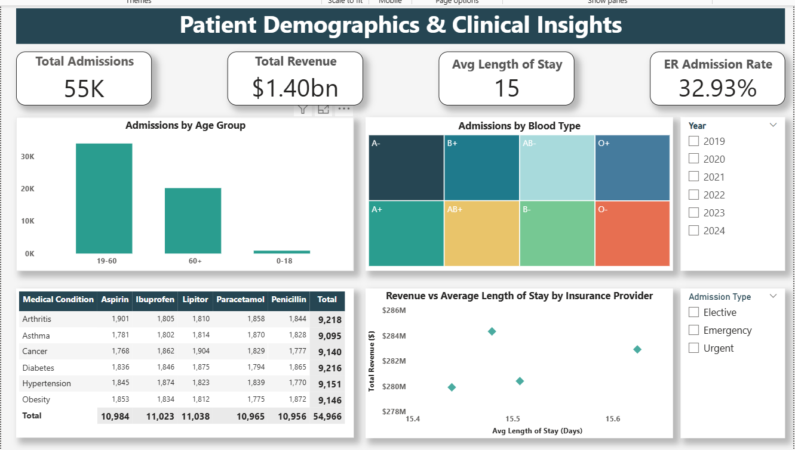
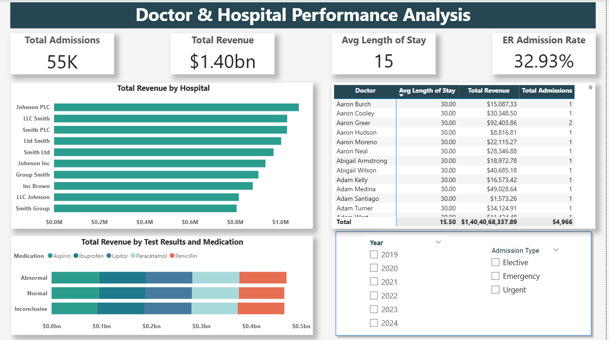

# Healthcare Operational Performance & Revenue Analytics

## 🏥 Project Overview

This project presents a **3-page Power BI dashboard** designed to analyze **55,000+ hospital patient records** and provide actionable insights into financial performance, clinical patterns, and operational efficiency.

The dashboard acts as a  **“Pulse Check” for hospital performance** , centralizing financial, clinical, and operational metrics in one interactive report.

**Key findings:**

* **Total Revenue:** $1.40B
* **Total Admissions:** 55K
* **Average Length of Stay:** 15 Days
* **ER Admission Rate:** 32.93%

These insights help hospital leadership make  **data-driven decisions for resource allocation, staffing, and patient care optimization** .

---

## 📊 Dashboard Preview

### Executive Summary

### Patient Demographics & Clinical Insights

### Doctor & Hospital Performance

---

## 🚀 Key Features

### Executive Summary

High-level KPI monitoring including:

* Total Admissions
* Total Revenue
* Average Length of Stay
* ER Admission Rate

### Clinical Insights

Detailed analysis of:

* Patient demographics (Age Groups, Blood Types)
* Medication distribution
* Abnormal vs Normal test result patterns

### Operational Analysis

Performance insights across:

* **Hospitals**
* **Doctors**
* **Insurance providers**

Includes **ranking and filtering capabilities** to identify top performers.

### Interactive Dashboard

Users can dynamically filter data by:

* Year
* Admission Type
* Medical Condition

---

## 🛠 Tech Stack & Skills Demonstrated

### Power Query (ETL)

* Cleaned and standardized **55K+ rows of healthcare data**
* Handled duplicates and missing values
* Engineered **Length of Stay** metric

### Data Modeling

* Implemented a **Star Schema**
* Built a **custom Calendar table** using DAX

### DAX (Data Analysis Expressions)

Created analytical measures including:

* **ER Admission Rate**

  Calculated using `DIVIDE()` and `CALCULATE()` to monitor emergency load.
* **Total Revenue**

  Aggregated billing across hospitals and insurance providers.
* **Average Length of Stay**

  Derived from admission and discharge dates.

### Data Visualization

Used Power BI visuals to highlight insights:

* KPI Cards
* Treemaps
* Donut Charts
* Stacked Bar Charts
* Scatter Plots
* Conditional Formatting (Heatmaps)

---

## 📂 Project Structure

<pre class="overflow-visible! px-0!" data-start="3170" data-end="3559">

Healthcare-Analytics-Dashboard/ ├── 01_Data/ │   └── healthcare_dataset.csv ├── 02_Scripts/ │   └── DAX_Measures.txt ├── 03_Report/ │   └── Healthcare_Operations_Analytics_v1.0.pbix ├── 04_Documentation/ │   ├── Executive_Overview_Dashboard.png │   ├── Patient_Demographics_Insights.png │   ├── Doctor_Hospital_Performance.png │   └── Project_Implementation_Guide.pdf └── README.md

</pre>

---

## 📈 Business Impact

### Financial Oversight

Automated monitoring of **$1.40B in hospital billing revenue** across multiple insurance providers.

### Resource Optimization

Identified that  **32.93% of admissions originate from the Emergency Department** , highlighting staffing and capacity planning needs.

### Clinical Quality Insights

Revealed  **medication distribution patterns across medical conditions** , helping identify treatment trends for diseases such as  **Diabetes, Cancer, and Hypertension** .

---

## ▶️ How to Use

1. Download the `.pbix` file from the **03_Report** folder.
2. Open it using  **Microsoft Power BI Desktop** .
3. Use slicers to filter data by  **Year, Admission Type, or Medical Condition** .

---

## 👨‍💻 Author

**Akash Gupta**

Aspiring Data Analyst | Power BI | SQL | Data Visualization
